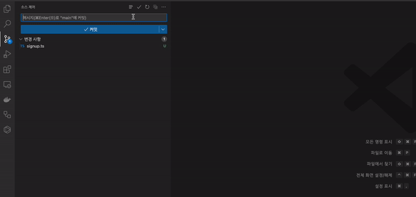

# Commit Message Translator

Welcome to Commit Message Translator for Visual Studio Code! This extension leverages the power of the DeepL Translate API to seamlessly translate your commit messages from Korean to English. Ideal for international teams and open-source projects where English is the primary language of communication.

## Preview

## Key Features

- **Korean to English Translation**: Automatically translate your commit messages from Korean to English.
- **Easy to Use**: A simple and intuitive interface integrated right into VSCode.
- **DeepL API Integration**: Powered by the reliable and accurate DeepL Translate API.

## Installation

1. Search for 'Commit Message Translator' in the VSCode Extensions Marketplace.
2. Click 'Install' to add it to your VSCode environment.

## Usage

1. **Write Your Commit Message**: Simply write your commit message in Korean as you normally would.
2. **Translate**: Click the 'Translate' button in the GitHub extension menu.
3. **Enter API Key**: If you haven't already set up a DeepL API key, you will be prompted to enter it. This is required for the translation service.
   1. Go to the [DeepL Page](https://www.deepl.com/pro#developer).
4. **Commit**: Your commit message will be translated to English. Review and commit as usual.

## Requirements

- Visual Studio Code: ^1.83.1
- Git Extension
- DeepL API key (for translation functionality)
  `commit-translator.deepl.apiKey`

## Feedback and Contributions

Your feedback and contributions are welcome! Please feel free to submit issues and pull requests to the GitHub repository.

---
